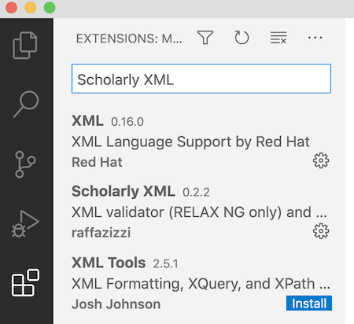

# Technical prerequisites and configuration

## Required software

1. *Contributing editors*.  You can participate in our hackathon as a contribution editor using only a web browser, but we strongly recommend that you install [Visual Studio Code](https://code.visualstudio.com/download), since this it supports more advanced collaborative editing.
2. *Hosts*. If you would like to host your team's editing session, in addition to a web browser and Visual Studio Code, you should install the [Julia](https://julialang.org/downloads/) language. That's all that's required to host a session at our Hackathon.  If you want to host your a team's work back at your home school, you should also install `git`.  We will provide follow up information on Saturday about how to install `git` on different operating systems.

## Configuring VS Code

Visual Studio Code has a plethora of extensions you can add for specific kinds of editing.    To add an extension, first select from the column of icons on the far left of your VS Code window the "Extensions" icon that looks like four puzzle pieces (illustrated here).  Then search for the name of the extension you want to add.  (Here we have searched for "Scholarly XML".)

We will use three main plugins at our Hackathon.

1. Scholarly XML: we use this to edit our texts
2. Rainbow CSV: we use this to create tables of data
3. Liveshare: this lets us share an editing window over the internet!  So cool!

